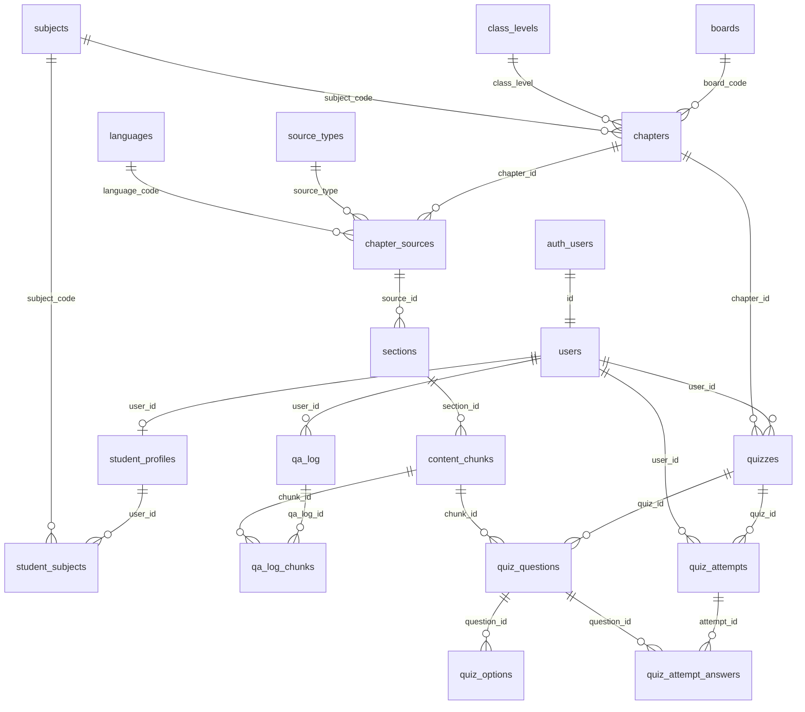

# Database schema v2 — PROPOSAL, pending approval

**Status: not yet applied.** Nothing in this file exists in any database. The v1 migrations
(`supabase/migrations/0001_init.sql`, `0002_match_function.sql`) have never been run against a live
Supabase project, so on approval this design **replaces them in place** — there is no data to
migrate and no downtime to plan around.

Target platform: Supabase-hosted Postgres 15+ with pgvector.

## Design commitments

1. **BCNF (highest practical normal form).** Every non-key attribute depends on the whole key and
   nothing else. No arrays, no JSONB repeating groups, no duplicated chapter metadata across chunk
   rows. Every enumerated domain is a reference table with a natural code key, so domains can grow
   (new boards, subjects, languages) with an `INSERT`, never a migration.
2. **Atomicity.** Every multi-row write (ingestion batch, quiz creation, grading submission) is one
   transaction: all rows land or none do.
3. **ACID enforced by the database, not by convention.** Foreign keys, `CHECK` constraints, unique
   constraints and `NOT NULL` carry the invariants. If application code has a bug, the database
   still cannot enter an inconsistent state.
4. **Zero dependencies.** One self-contained SQL file, idempotent (`IF NOT EXISTS` /
   `ON CONFLICT DO NOTHING`), runnable start-to-finish in the Supabase SQL Editor. The **only**
   extension is pgvector, which the product cannot function without (embeddings). `gen_random_uuid()`
   is Postgres 13+ core — no pgcrypto. No third-party schemas, no external services, no seed files
   beyond reference data inserted by the migration itself.
5. **The API contract does not change.** `match_content_chunks` v2 returns exactly the same row
   shape as v1, so `src/lib/types.ts` (`RetrievedChunk`), the `/api/ask` route, and the UI are
   untouched. Normalization is an internal improvement.

---

## Entity-relationship diagram



The curriculum chain is five levels deep on purpose: a chunk's board/class/subject/title/pages are
reached by joining `content_chunks → sections → chapter_sources → chapters`. Storing any of that on
the chunk row itself is a transitive dependency — that was v1's core defect.

---

## 1. Reference tables (enumerated domains)

Natural code keys (`text`/`smallint`), no surrogate IDs — reads stay human-friendly and joins stay
cheap. Seeded by the migration; extending a domain is a row insert, not a schema change.

```sql
create table if not exists boards (
  board_code   text primary key,           -- 'PCTB'
  board_name   text not null,              -- 'Punjab Curriculum and Textbook Board'
  created_at   timestamptz not null default now()
);

create table if not exists class_levels (
  class_level  smallint primary key check (class_level between 1 and 12),
  label        text not null               -- 'Class 10'
);

create table if not exists subjects (
  subject_code text primary key,           -- 'physics'
  subject_name text not null               -- 'Physics'
);

create table if not exists languages (
  language_code text primary key,          -- 'en', 'ur'
  language_name text not null
);

create table if not exists source_types (
  source_type  text primary key,           -- 'textbook', 'past_paper', 'marking_scheme'
  description  text not null default ''
);

create table if not exists user_roles (
  role_code    text primary key,           -- 'student', 'guardian', 'admin'
  description  text not null default ''
);

create table if not exists gate_decisions (
  decision     text primary key            -- 'PASS', 'BORDERLINE', 'REFUSE'
);

create table if not exists refusal_reasons (
  reason_code  text primary key            -- 'no_candidates', 'low_similarity', 'ungrounded_output'
);

create table if not exists quiz_difficulties (
  difficulty   text primary key            -- 'easy', 'medium', 'hard'
);
```

Seed data (shipped inside the migration, `on conflict do nothing`):

```sql
insert into boards (board_code, board_name) values
  ('PCTB', 'Punjab Curriculum and Textbook Board'),
  ('FBISE', 'Federal Board of Intermediate and Secondary Education')
on conflict do nothing;

insert into class_levels (class_level, label)
select g, 'Class ' || g from generate_series(1, 12) as g
on conflict do nothing;

insert into subjects (subject_code, subject_name) values
  ('physics', 'Physics'), ('chemistry', 'Chemistry'),
  ('biology', 'Biology'), ('mathematics', 'Mathematics'),
  ('english', 'English'), ('urdu', 'Urdu')
on conflict do nothing;

insert into languages (language_code, language_name) values
  ('en', 'English'), ('ur', 'Urdu')
on conflict do nothing;

insert into source_types (source_type, description) values
  ('textbook', 'Official board textbook'),
  ('past_paper', 'Past board examination paper'),
  ('marking_scheme', 'Official marking scheme')
on conflict do nothing;

insert into user_roles (role_code, description) values
  ('student', 'Student'), ('guardian', 'Parent or guardian'), ('admin', 'Administrator')
on conflict do nothing;

insert into gate_decisions (decision) values ('PASS'), ('BORDERLINE'), ('REFUSE')
on conflict do nothing;

insert into refusal_reasons (reason_code) values
  ('no_candidates'), ('low_similarity'), ('ungrounded_output')
on conflict do nothing;

insert into quiz_difficulties (difficulty) values ('easy'), ('medium'), ('hard')
on conflict do nothing;
```

## 2. Identity and student profile

```sql
create table if not exists users (
  id                 uuid primary key references auth.users(id) on delete cascade,
  role_code          text not null default 'student' references user_roles(role_code),
  display_name       text not null default '',
  preferred_language text not null default 'en' references languages(language_code),
  created_at         timestamptz not null default now()
);

create table if not exists student_profiles (
  user_id     uuid primary key references users(id) on delete cascade,
  board_code  text not null references boards(board_code),
  class_level smallint not null references class_levels(class_level),
  exam_date   date,
  created_at  timestamptz not null default now()
);

-- v1 stored subjects as text[] on the profile — an array is a repeating group (1NF violation).
create table if not exists student_subjects (
  user_id      uuid not null references student_profiles(user_id) on delete cascade,
  subject_code text not null references subjects(subject_code),
  primary key (user_id, subject_code)
);
```

## 3. Curriculum content (the grounding corpus)

```sql
create table if not exists chapters (
  id            uuid primary key default gen_random_uuid(),
  board_code    text not null references boards(board_code),
  class_level   smallint not null references class_levels(class_level),
  subject_code  text not null references subjects(subject_code),
  chapter_no    int not null check (chapter_no > 0),
  chapter_title text not null,
  created_at    timestamptz not null default now(),
  unique (board_code, class_level, subject_code, chapter_no)
);

-- One row per ingested document for a chapter: the textbook, a past paper, a marking scheme.
-- source_type and language are document-level facts — v1 duplicated them onto every chunk (3NF).
create table if not exists chapter_sources (
  id            uuid primary key default gen_random_uuid(),
  chapter_id    uuid not null references chapters(id) on delete cascade,
  source_type   text not null references source_types(source_type),
  language_code text not null references languages(language_code),
  created_at    timestamptz not null default now(),
  unique (chapter_id, source_type, language_code)
);

-- Page ranges are section-level facts. v1 stamped the same page range onto every chunk of a
-- section (3NF). section_label is what the citation chip shows: '14.3 Ohm''s Law and Resistance'.
create table if not exists sections (
  id            uuid primary key default gen_random_uuid(),
  source_id     uuid not null references chapter_sources(id) on delete cascade,
  section_label text not null,
  position      smallint not null check (position > 0),
  page_from     int,
  page_to       int,
  check (page_from is null or page_to is null or page_from <= page_to),
  unique (source_id, section_label)
);

create table if not exists content_chunks (
  id           uuid primary key default gen_random_uuid(),
  section_id   uuid not null references sections(id) on delete cascade,
  chunk_index  smallint not null check (chunk_index > 0),
  content      text not null check (length(btrim(content)) > 0),
  -- sha256 of normalised content + curriculum identity; makes ingestion idempotent.
  content_hash text not null unique,
  -- Must match EMBEDDING_DIM and the embedding model. Change all three together, and re-embed
  -- everything — a mismatch fails inserts with an error that never mentions the model.
  embedding    vector(1024) not null,
  created_at   timestamptz not null default now(),
  unique (section_id, chunk_index)
);

create index if not exists content_chunks_embedding_idx
  on content_chunks using hnsw (embedding vector_cosine_ops);
create index if not exists content_chunks_section_idx on content_chunks (section_id);
create index if not exists sections_source_idx        on sections (source_id);
create index if not exists chapter_sources_chapter_idx on chapter_sources (chapter_id);
-- chapters' natural unique constraint already indexes the retrieval filter
-- (board_code, class_level, subject_code).
```

## 4. Question-answer log

```sql
create table if not exists qa_log (
  id                uuid primary key default gen_random_uuid(),
  -- SET NULL, not CASCADE: a deleted student's metrics must survive for the eval dashboard.
  user_id           uuid references users(id) on delete set null,
  subject_code      text references subjects(subject_code),
  question_language text references languages(language_code),
  top1_score        real check (top1_score between -1 and 1),
  support_count     int check (support_count >= 0),
  gate_decision     text references gate_decisions(decision),
  refusal_reason    text references refusal_reasons(reason_code),
  latency_total_ms  int check (latency_total_ms >= 0),
  created_at        timestamptz not null default now()
);

-- v1 stored retrieved_chunk_ids and cited_chunk_ids as uuid[] — two arrays (1NF violation) that
-- also lost each chunk's score and rank. The junction row is atomic and keeps everything.
create table if not exists qa_log_chunks (
  qa_log_id  uuid not null references qa_log(id) on delete cascade,
  chunk_id   uuid not null references content_chunks(id) on delete cascade,
  rank       smallint not null check (rank > 0),
  score      real not null check (score between -1 and 1),
  was_cited  boolean not null default false,
  primary key (qa_log_id, chunk_id)
);

create index if not exists qa_log_created_idx on qa_log (created_at desc);
create index if not exists qa_log_chunks_chunk_idx on qa_log_chunks (chunk_id);
```

## 5. Quizzes

```sql
create table if not exists quizzes (
  id         uuid primary key default gen_random_uuid(),
  user_id    uuid not null references users(id) on delete cascade,
  chapter_id uuid not null references chapters(id),
  difficulty text not null default 'medium' references quiz_difficulties(difficulty),
  created_at timestamptz not null default now()
);

create table if not exists quiz_questions (
  id          uuid primary key default gen_random_uuid(),
  quiz_id     uuid not null references quizzes(id) on delete cascade,
  position    smallint not null check (position > 0),
  stem        text not null,
  -- SET NULL: deleting a corpus chunk must not cascade-delete a student's quiz history.
  chunk_id    uuid references content_chunks(id) on delete set null,
  explanation text,
  unique (quiz_id, position)
);

-- v1 stored options as jsonb — a repeating group (1NF violation). Each option is an atomic row.
create table if not exists quiz_options (
  question_id   uuid not null references quiz_questions(id) on delete cascade,
  option_index  smallint not null check (option_index >= 0),
  option_text   text not null check (length(btrim(option_text)) > 0),
  is_correct    boolean not null default false,
  primary key (question_id, option_index)
);

-- Enforces AT MOST one correct option per question at the database level.
create unique index if not exists quiz_options_one_correct
  on quiz_options (question_id) where is_correct;

create table if not exists quiz_attempts (
  id           uuid primary key default gen_random_uuid(),
  quiz_id      uuid not null references quizzes(id) on delete cascade,
  user_id      uuid not null references users(id) on delete cascade,
  score        int not null check (score >= 0),
  total        int not null check (total > 0),
  answered     int not null check (answered >= 0),
  submitted_at timestamptz not null default now(),
  check (score <= total and answered <= total)
);

-- v1 stored answers as jsonb. Atomic rows: one per question answered in an attempt.
create table if not exists quiz_attempt_answers (
  attempt_id            uuid not null references quiz_attempts(id) on delete cascade,
  question_id           uuid not null references quiz_questions(id) on delete cascade,
  selected_option_index smallint check (selected_option_index >= 0),  -- null = unanswered
  is_correct            boolean not null,
  primary key (attempt_id, question_id)
);
```

**Answer secrecy is structural, not conventional:** `quiz_options.is_correct` is readable only
through the service role (see RLS below). The browser cannot select from `quiz_options` at all —
this preserves the invariant that answers never reach the client before submission, even after
quizzes are persisted and `src/lib/quiz/answer-key.ts` is retired.

## 6. Row Level Security

RLS is enabled on every table. Retrieval and ingestion run with the service role, which bypasses
RLS deliberately (see `src/lib/supabase/admin.ts` — the anon-key path would return zero rows and
the app would refuse every question with no visible error).

```sql
-- Reference data and curriculum are not sensitive: readable by anyone, writable by no one
-- except the service role (which bypasses RLS for ingestion).
create policy ref_read on boards          for select using (true);
-- (identical select-true policies on class_levels, subjects, languages, source_types,
--  user_roles, gate_decisions, refusal_reasons, quiz_difficulties)

-- Owner-only rows.
create policy users_self on users
  for all using (id = auth.uid()) with check (id = auth.uid());
create policy profiles_self on student_profiles
  for all using (user_id = auth.uid()) with check (user_id = auth.uid());
create policy student_subjects_self on student_subjects
  for all using (user_id = auth.uid()) with check (user_id = auth.uid());

-- Curriculum readable by a student whose profile matches it. This is the normalised form of
-- v1's chunks_match_profile — the subjects array becomes a join on student_subjects.
create policy chunks_match_profile on content_chunks for select using (
  exists (
    select 1
    from sections s
    join chapter_sources cs on cs.id = s.source_id
    join chapters ch         on ch.id = cs.chapter_id
    join student_profiles p  on p.board_code = ch.board_code
                            and p.class_level = ch.class_level
    join student_subjects ss on ss.user_id = p.user_id
                            and ss.subject_code = ch.subject_code
    where s.id = content_chunks.section_id
      and p.user_id = auth.uid()
  )
);
-- (matching select policies on chapters, chapter_sources, sections via the same join)

create policy qa_log_own on qa_log
  for all using (user_id = auth.uid()) with check (user_id = auth.uid());
create policy quizzes_own on quizzes
  for all using (user_id = auth.uid()) with check (user_id = auth.uid());
create policy quiz_questions_own on quiz_questions for select using (
  exists (select 1 from quizzes q where q.id = quiz_questions.quiz_id and q.user_id = auth.uid())
);
create policy quiz_attempts_own on quiz_attempts
  for all using (user_id = auth.uid()) with check (user_id = auth.uid());
create policy quiz_attempt_answers_own on quiz_attempt_answers for select using (
  exists (select 1 from quiz_attempts a where a.id = quiz_attempt_answers.attempt_id
                                          and a.user_id = auth.uid())
);

-- quiz_options gets NO policy for anon/authenticated. Deny-by-default: the answer key never
-- leaves the server. Grading reads it with the service role only.
```

## 7. The retrieval function (v2)

Same signature and return shape as v1 — `src/lib/ai/retrieval.ts` and `RetrievedChunk` do not
change. Only the internals become joins over the normalised tables.

```sql
create or replace function match_content_chunks(
  query_embedding  vector(1024),
  filter_board     text,
  filter_class     int,
  filter_subject   text,
  match_count      int default 20
)
returns table (
  id            uuid,
  chapter_no    int,
  chapter_title text,
  section       text,
  page_from     int,
  page_to       int,
  source_type   text,
  content       text,
  score         double precision
)
language sql
stable
as $$
  select
    c.id,
    ch.chapter_no,
    ch.chapter_title,
    s.section_label,
    s.page_from,
    s.page_to,
    cs.source_type,
    c.content,
    -- <=> is cosine DISTANCE in pgvector. Score = 1 - distance: higher is better, and the
    -- thresholds in docs/confidence-guardrails.md read the way you'd expect.
    (1 - (c.embedding <=> query_embedding))::double precision as score
  from content_chunks c
  join sections s         on s.id = c.section_id
  join chapter_sources cs on cs.id = s.source_id
  join chapters ch        on ch.id = cs.chapter_id
  where lower(ch.board_code)   = lower(filter_board)
    and ch.class_level         = filter_class
    and lower(ch.subject_code) = lower(filter_subject)
  order by c.embedding <=> query_embedding
  limit match_count;
$$;

-- Server-side only, exactly as v1: callable with the service role, never by anon.
revoke all on function match_content_chunks from anon;
grant execute on function match_content_chunks to service_role;
```

The curriculum filter still runs in SQL, always — an unfiltered search is a bug that breaks
grounding (invariant 6). The HNSW index serves the ordering; the filter rides the join.

## 8. ACID, concretely

| Property | How this schema guarantees it |
| --- | --- |
| **Atomicity** | Ingestion upserts one document's chapters → sources → sections → chunks in a single transaction; quiz creation (quiz + questions + options) and grading (attempt + answers) likewise. Partial state is impossible. |
| **Consistency** | Every relationship is a FK; every bounded value is a `CHECK` or reference-table FK (`score between -1 and 1`, `page_from <= page_to`, `score <= total`, exactly-one-correct-option partial unique index). No application bug can write an invalid row. |
| **Isolation** | Default `READ COMMITTED`. Concurrent ingestion runs are safe: the `content_hash` unique constraint serialises duplicates; writers use `on conflict do nothing` / upsert. |
| **Durability** | Postgres WAL, managed by Supabase. Committed rows survive crashes. |

## 9. What v1 got wrong and how v2 fixes it

| v1 defect | NF violated | v2 fix |
| --- | --- | --- |
| `student_profiles.subjects text[]` | 1NF (array) | `student_subjects` junction table |
| `qa_log.retrieved_chunk_ids` / `cited_chunk_ids uuid[]` | 1NF (arrays) | `qa_log_chunks` junction, keeps per-chunk `rank` + `score` |
| `quiz_questions.options jsonb` | 1NF (repeating group) | `quiz_options` table with `is_correct` |
| `quiz_attempts.answers jsonb` | 1NF (repeating group) | `quiz_attempt_answers` table |
| `chapter_title`, `page_from/to`, `source_type`, `language` duplicated on every chunk | 3NF (transitive deps) | `chapters` / `chapter_sources` / `sections` chain |
| Domain values as inline `check (... in (...))` | — | Reference tables; domains grow by `INSERT` |
| `qa_log.user_id on delete cascade` | — | `SET NULL`: eval metrics survive account deletion |
| `quiz_questions.chunk_id` cascade | — | `SET NULL`: corpus edits don't erase quiz history |

## 10. What changes downstream (after approval)

1. Replace `supabase/migrations/0001_init.sql` with this schema (keep `0002` as the function
   above, re-pointed at the normalised tables). Both files have never been executed — replacing
   them keeps the history clean rather than stacking a corrective migration.
2. `scripts/ingest.ts`: upsert chapter → source → section rows first, then insert chunks with
   `section_id`. One document = one transaction.
3. `src/lib/qa-log.ts`: write the junction rows in `qa_log_chunks` instead of the two arrays.
4. `docs/database.md` and `docs/project-status.md` updated in the same change.
5. Quiz persistence (remaining-work item 6) builds directly on section 5 and retires
   `answer-key.ts`.

---

## Approval checklist

- [ ] Normalization depth accepted (5-level curriculum chain: chapters → chapter_sources →
      sections → content_chunks)
- [ ] Reference tables accepted in place of inline `CHECK (... IN ...)` constraints
- [ ] `quiz_options` deny-by-default RLS accepted as the post-persistence answer-secrecy model
- [ ] Naming conventions accepted (snake_case, plural tables, natural code keys on reference data)
- [ ] `vector(1024)` reconfirmed against `text-embedding-v3` before the migration is run
